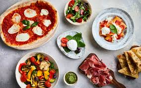

# 

<table>
<tr>
<td>
  A very nice pizza web app bundled with everything that a wesite needs and in put field that can take orders and customers feedback.

## Demo

Here is a working live demo :https://hassan1a.github.io/DELANI-STUDIO/

## Site

### Landing Page

This web app interacts with the user fully by getting the order of which the user wants,displays the total of the items keyed in through a table.Then it prompts the user to input whether the order is supposed to be delivered or collected through a form and if it is delivered it prompts for location of delivery then finally it summarizes the whole order cost through an alert.

## Mobile support

The Web is compatible with devices of all sizes and all OS's, and consistent improvements are being made to make sure no device or OS's is left out.

## [Usage](https://hassan1a.github.io/DELANI-STUDIO/)

### Development

Want to contribute? Great!

To fix a bug or enhance an existing module, follow these steps:

- Fork the repo
- Create a new branch (`git checkout -b improve-feature`)
- Make the appropriate changes in the files
- Add changes to reflect the changes made
- Commit your changes (`git commit -am 'Improve feature'`)
- Push to the branch (`git push origin improve-feature`)
- Create a Pull Request

### Bug / Feature Request

If you find a bug (the website couldn't handle the query and / or gave undesired results), kindly open an issue [here](https://github.com/HASSAN1A/TOKYOARTISANPIZZA-/issues/new) by including your search query and the expected result.
If you'd like to request a new function, feel free to do so by opening an issue [here](https://github.com/HASSAN1A//issues/TOKYOARTISANPIZZA). Please include sample queries and their corresponding results.

## Built with

1.html (https://www.w3schools.com/html/default.asp)

2.css (https://www.w3schools.com/css/css_colors.asp)

3.Javascript://https://javascript.info/ifelse

4.Bootstrap:https://getbootstrap.com/docs/4.5/components/jumbotron/

5.JQuery:https://jquery.com/

## To-do

- To work on any issue that may arise,maintain the site and allow others to pair programme with me by raising their comments/issues that so that we work on them to achieve a common goal .

## Team

[Hassan Juma ](https://github.com/HASSAN1A)

## [License](https://github.com/HASSAN1A/TOKYOARTISANPIZZA-/blob/master/LICENSE.md)

[MIT](https://https://github.com/HASSAN1A/TOKYOARTISANPIZZA-/blob/master/LICENSE.md) © [Hassan Juma](https://github.com/HASSAN1A)
